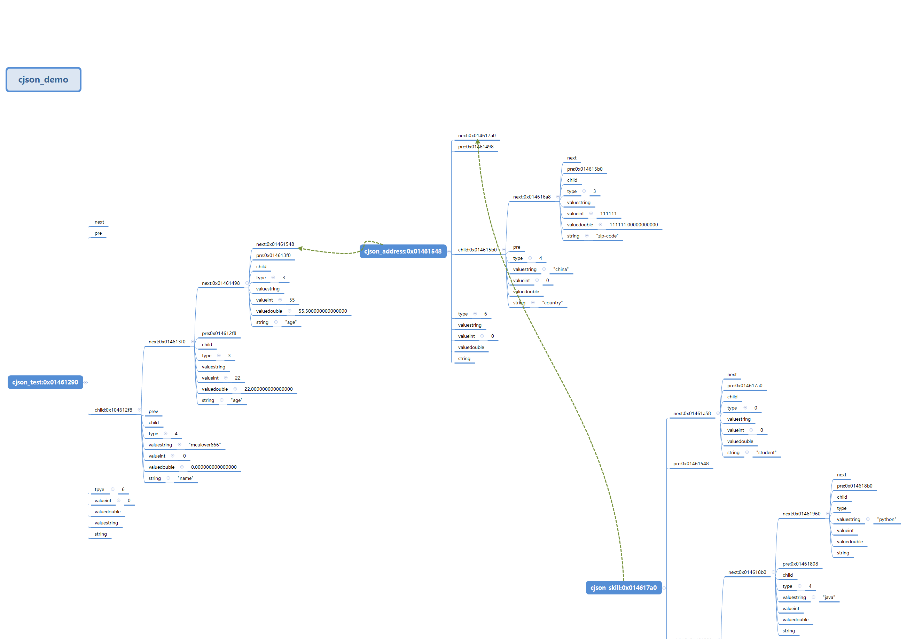

#  cJSON 学习

##   还没看的时候

1. 获得json 的长度是 lens +  1 因为默认root 是lens =0 ,应该也是有一个元长度的才对。

2. 将字符串 phrase 成 json 之后，又多个许可，其实是一个 json array, 先从json array 中 解析出 array items ,  再从 arrayitem  中解析出某一个字段，object Item ,  object 下的 valuestring 就是我需要解析的字段。 

   >   学完就不是这么想了

   >   特别鸣谢好心人的博客：https://blog.csdn.net/Mculover666/article/details/103796256

##   JSON

JSON 全称 JavaScript Object Notation，即 JS对象简谱，是一种轻量级的数据格式。

它采用完全独立于编程语言的文本格式来存储和表示数据，语法简洁、层次结构清晰，易于人阅读和编写，同时也易于机器解析和生成，有效的提升了网络传输效率。

###  语法规则

JSON对象是一个无序的"名称/值"键值对的集合：

以"{“开始，以”}"结束，允许嵌套使用；
每个名称和值成对出现，名称和值之间使用":"分隔；
键值对之间用","分隔
在这些字符前后允许存在无意义的空白符；
对于键值，可以有如下值：

一个新的json对象
数组：使用"[“和”]"表示
数字：直接表示，可以是整数，也可以是浮点数
字符串：使用引号"表示
字面值：false、null、true中的一个(必须是小写)
eg:

{
    "name": "mculover666",
    "age": 22,
    "weight": 55.5
    "address":
    {
        "country": "China",
        "zip-code": 111111
    },
    "skill": ["c", "Java", "Python"],
    "student": false
}

上述json 结构在内存中的位置示例：

不是十分准确的总结一句：

1. 头指针只有 child 指向首节点
2. 首节点next 存放下一个节点的地址
3. 同一层级的在next，不同曾经的在 child .例如json address。 是mculover666下的嵌套json
4. json_skill 是mculover666小的 json 数组

   

footnote[^footnote].:smile:

[^footnote]: footnote test

