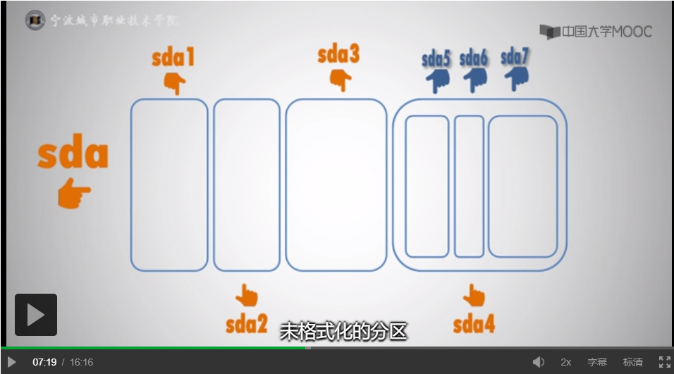
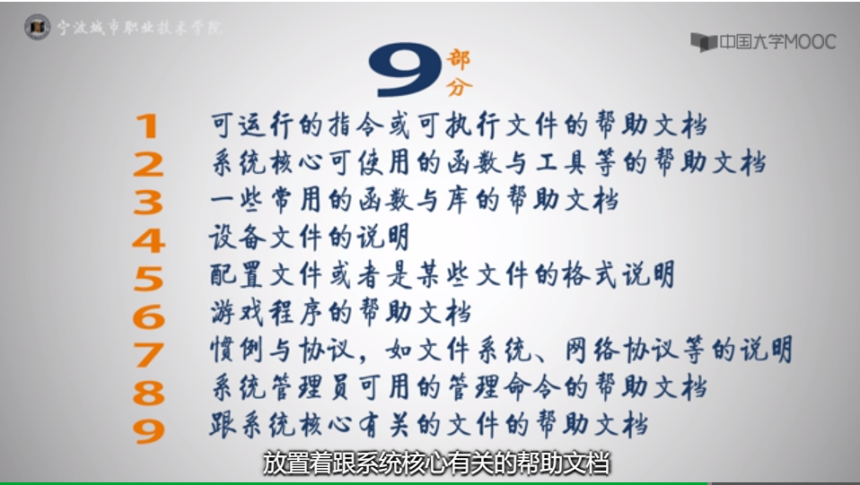

#  Linux操作系统

##  关于Linux

1. Linux 的创造者
   1. Linux之父 linus Torvalds  1991
   2. 自由软件之父： Richard Stallman  发起 GNU 运动
   3. 全称： GUN/linux
   4. linux 有各种各样的发行版本，其差异并不是由内核造成的，不同的发行版本有其外部驱动的差异。

2. linux 版本
   1.  内核版本：由开源基金会发行维护， www.kernel.org 可以看内核源代码
   2. 发行版本：centos完全兼容红帽,跟新免费
3. 下载iso 文件 
   
1. 计算hash 值 certutil -hashfile Y:\CentOS-7-x86_64-DVD-2009.iso sha256
   
4. 安装Linux
   1. 硬盘分区：

      1. 第一块硬盘 sda 第二块硬盘 sdb 以此类推

      2. 一块硬盘内的分区：sda1 sda 2

         

         
      
      3. swap 分区：当Linux中运行需要的内存比较大，超出物理的的物理内存的时候，解决办法就是把存不下的东西转移到硬盘的虚拟内存中去 采用的是swap 文件系统，swap分区也不能挂载到某个文件中去，因此在文件目中是看不到这个分区的
   
      4. 软件包依赖关系检测，很多软件会依赖另一个软件，检查依赖关系的时候会将安装的依赖的其他包一同安装上
      
      5. centos 7 创建分区、网络、桌面都在安装时可以配置
   
5. 与Linux进行交互

   1. bash : 打开命令提示符的窗口，就进入了 bash.

   2. 用 man 命令作帮助文档， /time 用于查找time关键字，用 n 跳转至下一个匹配处。 N 跳转至上一个匹配处。

      1. man 文档有9个部分：
         1. 
         2. 查看不同部分的文档实例   man 1 read
            1. 不同文档会用重名部分

   3. 关机和重启：

      1. 

      2. 关机  shutdown -h + 时间（数字）或者 now （表示立即）  +字符串（该字符串会被发送到每一个终端）

      3. 其他指令：

         

         不安全，是删除所有的进程，而不是平稳的终止他们

      